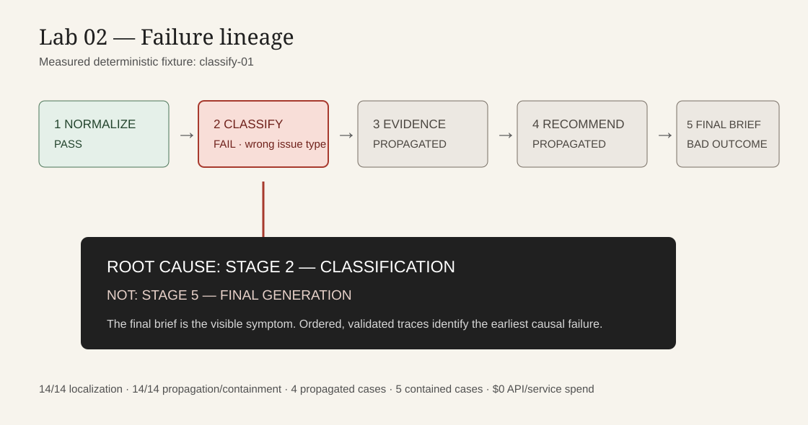

# Lab 02 — Failure Forensics

## Trace a bad AI outcome to the stage that caused it

**Problem:** A final bad output does not reveal which step in a multi-stage AI workflow caused the failure.

**Experiment:** A frozen, synthetic five-stage workflow runs 14 cases (three clean and 11 injected failures), records five structured stage traces per case, and deterministically identifies the earliest invalid stage.

**Measured result:** **14/14** first-failure localizations, **14/14** failure-type classifications, **14/14** propagation/containment determinations, and **70/70** complete stage traces. Four cases demonstrate real downstream propagation; five fail closed and contain the defect. The evidence-selection regression fixture fails before its bounded correction and passes after it.



## Why it matters

The visible failure is often downstream. In the illustrated classification case, the final brief is bad, but the causal failure is stage 2. The distinction lets a reviewer correct the narrow failing contract instead of rewriting the final-generation stage.

## Five-stage workflow

1. Normalize
2. Classify
3. Select evidence
4. Recommend
5. Generate final brief

Each stage consumes the preceding accumulated state and emits a structured trace containing a run and case ID, ordered stage index, input hash/reference and input state, output, validation outcome/errors, provider/runtime/model, latency, token fields when available, API/service cost, and execution status.

## Failure set and localization

The frozen 14-case set contains 3 clean runs, 2 contract/normalization failures, 2 classification failures, 2 evidence failures, 2 policy-authority failures, 2 final-synthesis failures, and 1 execution failure. `forensic.py` orders traces, validates run consistency, selects the earliest failed stage, and marks a later stage as propagated only when its consumed upstream state produces an observed invalid output. Blocked downstream stages are reported as contained, not propagated.

The taxonomy is intentionally small: `CONTRACT_FAILURE`, `CLASSIFICATION_FAILURE`, `EVIDENCE_FAILURE`, `POLICY_AUTHORITY_FAILURE`, `PROPAGATION_FAILURE`, `FINAL_SYNTHESIS_FAILURE`, and `EXECUTION_FAILURE`.

## Regression-fixture loop

`evidence-01` selects no evidence before correction, so localization reports `select_evidence / EVIDENCE_FAILURE`. The only correction restores the frozen case’s expected evidence ID. The same case then runs cleanly; this pre-fix/post-fix assertion is permanent in the test suite.

## Reproducibility and evidence

Run from this directory:

```bash
python3 run_lab.py
python3 -m pytest -q
```

Artifacts:

- [Frozen fixture configuration](configs/frozen_fixture_config.json)
- [Frozen cases](data/cases.jsonl)
- [Expected failures](data/expected_failures.jsonl)
- [Measured results](results/measured_results.json)
- [Structured traces](results/stage_traces.jsonl)

## Boundary

This is a local deterministic fixture, not a production observability platform or a claim about all AI workflows. On this frozen synthetic set only, the analyzer identified the expected first causal stage, failure type, and observed propagation-or-containment outcome in every case. It uses only synthetic data, invokes no model, reports token fields as unavailable, and incurred **$0 API/service spend**. Its measured latency is fixture execution latency, not LLM inference latency.
